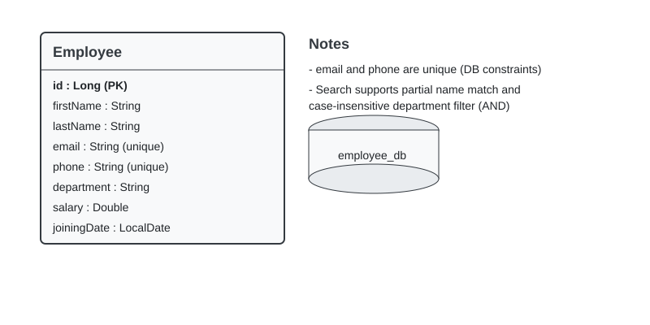
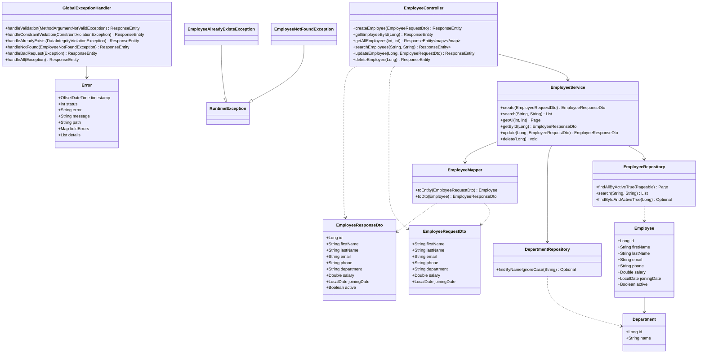

# Employee Management REST API

A small Spring Boot service providing CRUD and search functionality for employee records.

- Language: Java 25
- Frameworks: Spring Boot, Spring Data JPA, Bean Validation
- Database: MySQL

---

## Quick start (development)

Follow these steps to run the service locally.

1. Clone the repository

   ```bash
   git clone https://github.com/khanparaYash/internship-projects.git
   cd project2EmployeeManagement
   ```

2. Create a MySQL database and a local user (example)

   ```sql
   CREATE DATABASE employee_db CHARACTER SET utf8mb4 COLLATE utf8mb4_unicode_ci;
   ```

3. Configure database connection

   Edit `src/main/resources/application.properties` or set environment variables. Defaults used by the project:

   ```properties
   spring.datasource.url=jdbc:mysql://localhost:3306/employee_db
   spring.datasource.username=root
   spring.datasource.password=
   server.servlet.context-path=/api
   server.port=8000
   ```

   Replace credentials with your DB user (e.g., `appuser`) before starting.

4. Run the app (development)

   Windows:
   ```powershell
   .\mvnw spring-boot:run
   ```

   macOS / Linux:
   ```bash
   ./mvnw spring-boot:run
   ```

   The service will be available at: http://localhost:8000/api

---

## API Summary

Base URL: http://localhost:8000/api

Endpoints:

| Method | Path | Description |
|--------|------|-------------|
| POST | /employees | Create an employee |
| GET | /employees/{id} | Get employee by id |
| GET | /employees | List employees (paginated: page, size) |
| GET | /employees/search | Search employees by name and/or department |
| PUT | /employees/{id} | Update an employee |
| DELETE | /employees/{id} | Delete an employee |

Notes:
- Search semantics: when both `name` and `department` are provided, both must match (logical AND). `name` is partial, case-insensitive match against first or last name; `department` matches case-insensitively.
- Pagination for listing uses `page` (0-based) and `size` query params.

---

## Request / Response Examples

Create employee (curl):

```bash
curl -X POST "http://localhost:8000/api/employees" \
  -H "Content-Type: application/json" \
  -d '{
    "firstName": "Yash",
    "lastName": "Khanpara",
    "email": "yashkhanpara11@gmail.com",
    "phone": "8849930662",
    "department": "Engineering",
    "salary": 50000.0,
    "joiningDate": "2026-06-15"
  }'
```

Response (201 Created):

```json
{
  "id": 1,
  "firstName": "Yash",
  "lastName": "Khanpara",
  "email": "yashkhanpara11@gmail.com",
  "phone": "8849930662",
  "department": "Engineering",
  "salary": 50000.0,
  "joiningDate": "2026-06-15",
  "active": true
}
```

List employees (curl):

```bash
curl "http://localhost:8000/api/employees?page=0&size=10"
```

Response (200 OK):

```json
{
  "content": [
    {
      "id": 1,
      "firstName": "Yash",
      "lastName": "Khanpara",
      "email": "yashkhanpara11@gmail.com",
      "phone": "8849930662",
      "department": "Engineering",
      "salary": 50000.0,
      "joiningDate": "2026-06-15",
      "active": true
    }
  ],
  "page": 0,
  "size": 10,
  "totalElements": 42,
  "totalPages": 5
}
```

Search (curl):

```bash
curl "http://localhost:8000/api/employees/search?name=Yash&department=Engineering"
```

Response (200 OK):

```json
[
  {
    "id": 1,
    "firstName": "Yash",
    "lastName": "Khanpara",
    "email": "yashkhanpara11@gmail.com",
    "phone": "8849930662",
    "department": "Engineering",
    "salary": 50000.0,
    "joiningDate": "2026-06-15",
    "active": true
  }
]
```

---

## Data model & ER diagram

Entities:

- Department
  - id (PK)
  - name (unique, trimmed, case-insensitive lookup)
- Employee
  - id (PK)
  - firstName
  - lastName
  - email (unique)
  - phone (unique)
  - department_id (FK to Department)
  - salary
  - joiningDate
  - active

ER diagram (placeholder):



To generate the ER diagram quickly:
1. Open MySQL Workbench and connect to `employee_db` → Database → Reverse Engineer.
2. Export PNG and save to `docs/er-diagram.png`.

Alternatively, use dbdiagram.io or draw.io and export a PNG.

### UML class diagram



---

## Validation & Error handling

- Requests are validated using javax validation annotations on DTO fields (e.g. @NotBlank, @Email, @Pattern).
- Errors return a structured JSON payload with fields: timestamp, status, error, message, path, fieldErrors.

Example validation error (400 Bad Request):

```json
{
  "timestamp": "2026-09-15T09:00:00Z",
  "status": 400,
  "error": "Bad Request",
  "message": "Validation failed",
  "path": "/api/employees",
  "fieldErrors": {
    "email": "Invalid email"
  }
}
```

---

## Development notes

- For convenience the project currently runs with `spring.jpa.hibernate.ddl-auto=create-drop` (see `src/main/resources/application.properties`). This resets the schema on each run — switch to `update` for iterative development or use a migration tool (Flyway/Liquibase) before deploying to production.
- OpenAPI / Swagger UI is available at: http://localhost:8000/api/swagger-ui/index.html

---

## Running tests

```bash
./mvnw test
```

---
