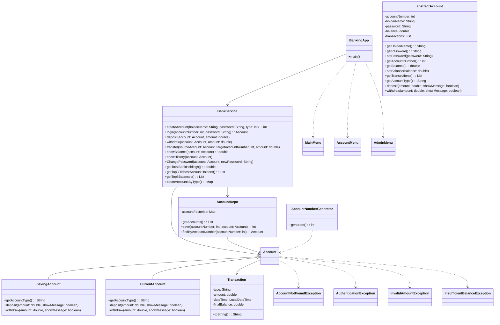

# Banking Console Application

A Java-based console banking system that simulates everyday banking operations such as account creation, secure login, deposits, withdrawals, transfers, transaction history, and admin analytics.

## Overview

This project is built as a beginner-friendly banking application using core Java concepts such as object-oriented programming, collections, custom exceptions, and a console-based menu-driven interface. It demonstrates a layered design with models, repositories, factories, services, and utility classes.

## Features

- Create a new savings or current account
- Secure customer login with account number and password
- Deposit money into an account
- Withdraw money with validation checks
- Check current balance
- View transaction history
- Change account password
- Transfer funds to another account
- Admin dashboard with bank statistics
- Auto-generated account numbers
- Colorized console output for better UX

## Tech Stack

- Java SE
- Object-Oriented Programming (OOP)
- Console-based menu-driven interface
- Java Collections and Streams API
- Custom exception handling

## Project Structure

```text
project_01_banking_console_app/
├── src/
│   ├── BankingApp.java
│   ├── enums/
│   │   ├── AccountMenu.java
│   │   ├── AccountTypeEnum.java
│   │   ├── AdminMenu.java
│   │   └── MainMenu.java
│   ├── exception/
│   │   ├── AccountNotFoundException.java
│   │   ├── AuthenticationException.java
│   │   ├── InsufficientBalanceException.java
│   │   └── InvalidAmountException.java
│   ├── factory/
│   │   ├── AccountFactory.java
│   │   ├── CurrentAccountFactory.java
│   │   └── SavingAccountFactory.java
│   ├── model/
│   │   ├── Account.java
│   │   ├── CurrentAccount.java
│   │   ├── SavingAccount.java
│   │   └── Transaction.java
│   ├── repo/
│   │   └── AccountRepo.java
│   ├── service/
│   │   └── BankService.java
│   ├── test/
│   │   ├── BankServiceCreateAccountValidationTest.java
│   │   ├── BankServiceCurrentAccountTest.java
│   │   └── BankServiceSavingAccountTest.java
│   └── util/
│       ├── AccountNumberGenerator.java
│       ├── Color.java
│       └── SimulateProcessing.java
├── uml-diagram.md
├── README.md
├── .gitignore
├── project_01_banking_console_app.iml
└── .idea/
```
## How to Run

### Prerequisites

* Java JDK 25 or later
* Git
* An IDE such as IntelliJ IDEA, Eclipse, or VS Code

### Clone the Repository

```bash
git clone <repository-url>
cd project_01_banking_console_app
```

### Run the Application

Open a terminal in the `src` directory:

```bash
cd src
```

Compile the application:

```bash
javac BankingApp.java
```

Run the application:

```bash
java BankingApp
```

### Run Using an IDE

Alternatively, open the project in your preferred IDE, open `src/BankingApp.java`, and run the `main()` method.

> **Note:** This application uses an in-memory repository, so account data is available only while the application is running.

## Default Admin Credentials

```text
Username: admin
Password: admin123
```

## Example Workflow

### Create account

```text
=== BANKING PORTAL ===
1. Create Account
2. Secure Login
3. Admin Login
4. Exit Terminal

Enter your choice: 1

1. Saving Account
2. Current Account
Enter your choice: 1
Enter Account Holder Name: Yash
Create Account Password: 1234
Generated Account Number: 100000
Successfully created
```

### Customer login and transaction

```text
Enter account number : 100000
Enter password : 1234
LogIn successfully Done!

===== ACCOUNT MENU =====
1. Deposit
2. Withdraw
3. Check Balance
4. View History
5. Change Password
6. Transfer
7. Logout
```

### Admin dashboard

```text
Enter admin username : admin
Enter admin password : admin123
Admin login successful.

===== ADMIN DASHBOARD =====
1. View total bank holdings
2. Top 3 richest account holders
3. Top 5 balances
4. Account count by type
5. Logout
```

## Design Notes

The application follows a simple layered architecture:

- Model layer: Account, SavingAccount, CurrentAccount, Transaction
- Repository layer: AccountRepo for account storage and lookup
- Factory layer: AccountFactory implementations for account creation
- Service layer: BankService for business logic and validation
- Utility layer: AccountNumberGenerator, Color, SimulateProcessing
- Entry point: BankingApp for console interaction

## UML Diagram


The standalone version is available in [uml-diagram.md](./uml-diagram.md).


## License

This project is intended for educational and learning purposes.

