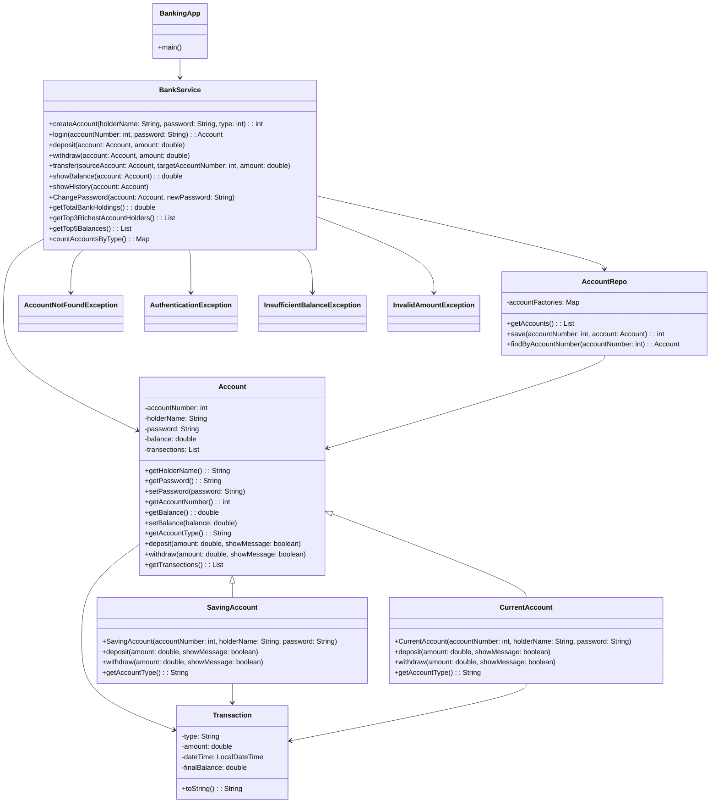

# Banking System UML Diagram

This file contains the UML class diagram for the banking application.

```mermaid
classDiagram
    class BankingApp {
        +main()
    }

    class BankService {
        +createAccount(holderName: String, password: String, type: int): int
        +login(accountNumber: int, password: String): Account
        +deposit(account: Account, amount: double)
        +withdraw(account: Account, amount: double)
        +transfer(sourceAccount: Account, targetAccountNumber: int, amount: double)
        +showBalance(account: Account): double
        +showHistory(account: Account)
        +ChangePassword(account: Account, newPassword: String)
        +getTotalBankHoldings(): double
        +getTop3RichestAccountHolders(): List<String>
        +getTop5Balances(): List<Double>
        +countAccountsByType(): Map<String, Long>
    }

    class AccountRepo {
        -accountFactories: Map<Integer, Account>
        +getAccounts(): List<Account>
        +save(accountNumber: int, account: Account): int
        +findByAccountNumber(accountNumber: int): Account
    }

    class Account {
        -accountNumber: int
        -holderName: String
        -password: String
        -balance: double
        -transections: List<Transaction>
        +getHolderName(): String
        +getPassword(): String
        +setPassword(password: String)
        +getAccountNumber(): int
        +getBalance(): double
        +setBalance(balance: double)
        +getAccountType(): String
        +deposit(amount: double, showMessage: boolean)
        +withdraw(amount: double, showMessage: boolean)
        +getTransections(): List<Transaction>
    }

    class SavingAccount {
        +SavingAccount(accountNumber: int, holderName: String, password: String)
        +deposit(amount: double, showMessage: boolean)
        +withdraw(amount: double, showMessage: boolean)
        +getAccountType(): String
    }

    class CurrentAccount {
        +CurrentAccount(accountNumber: int, holderName: String, password: String)
        +deposit(amount: double, showMessage: boolean)
        +withdraw(amount: double, showMessage: boolean)
        +getAccountType(): String
    }

    class Transaction {
        -type: String
        -amount: double
        -dateTime: LocalDateTime
        -finalBalance: double
        +toString(): String
    }

    class AccountNotFoundException
    class AuthenticationException
    class InsufficientBalanceException
    class InvalidAmountException

    BankingApp --> BankService
    BankService --> AccountRepo
    BankService --> Account
    BankService --> AccountNotFoundException
    BankService --> AuthenticationException
    BankService --> InsufficientBalanceException
    BankService --> InvalidAmountException

    AccountRepo --> Account
    Account <|-- SavingAccount
    Account <|-- CurrentAccount
    Account --> Transaction
    SavingAccount --> Transaction
    CurrentAccount --> Transaction
```
